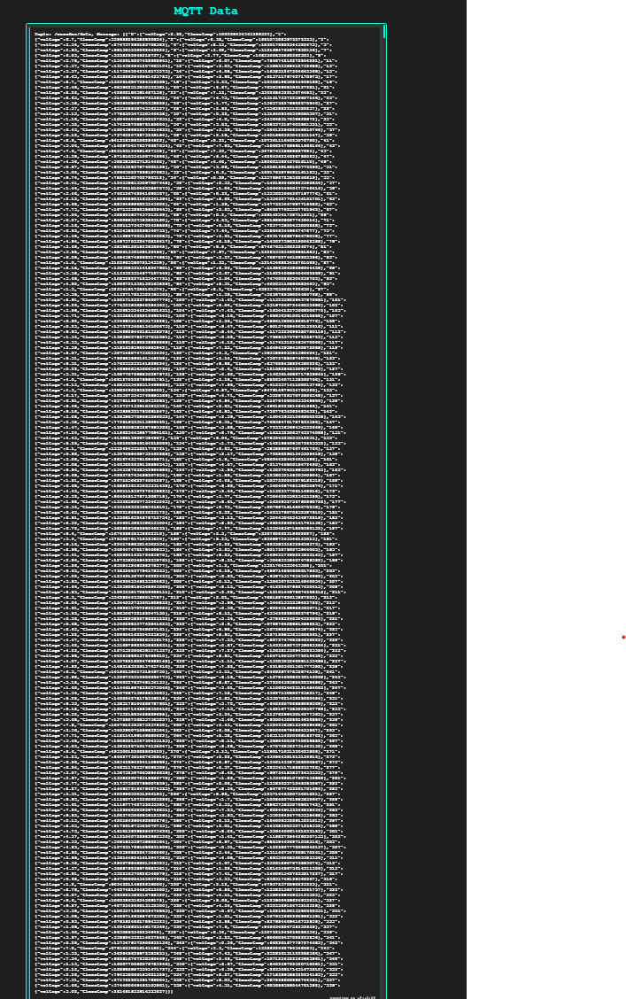
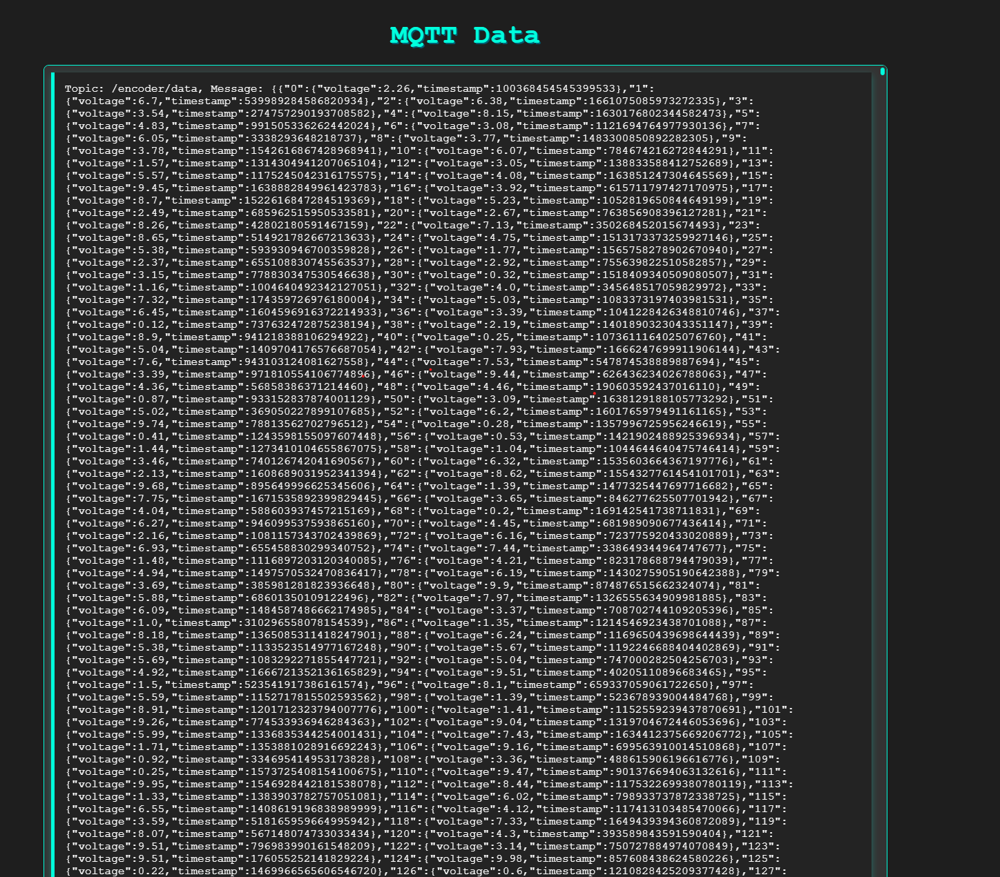

# TC3-tc3-mqtt-example

# Beckhoff and MQTT Communication Project

This project implements a communication system between a Beckhoff PLC and an MQTT broker. The program sends real-time data from the Beckhoff PLC to the MQTT broker every second, including angle, voltage, current, and a timestamp.

## Features

- **Data Transmission**: Sends five data points (angle, voltage, and timestamp) every second.
- **MQTT Protocol**: Uses MQTT for communication between the PLC and the broker.
- **Real-Time Monitoring**: Data is transmitted continuously, allowing for real-time monitoring and analysis.
  
## Data Format

The data is sent in JSON format with the following structure:

```json
{
    "0": {
        "Voltage": 5.870003747638806,
        "Timestamp": 1726508376770073367
....
    },
    "354": {
        "Voltage": 7.718909688128022,
        "Timestamp": 1726508376770078416
    },
    "355": {
        "Voltage": 4.679838622759933,
        "Timestamp": 1726508376770083499
    },
    "356": {
        "Voltage": 2.346466265056577,
        "Timestamp": 1726508376770088531
    },
    "357": {
        "Voltage": 2.4734128429966495,
        "Timestamp": 1726508376770093646
    },
    "358": {
        "Voltage": 8.273147433688733,
        "Timestamp": 1726508376770098816
    }
}
```
Data Fields:
Angle: The angle index (e.g., 353, 354, 355, etc.)
Voltage: Randomly generated voltage value
Current: Randomly generated current value
Timestamp: Random timestamp value for each angle

## Installation
Clone the repository
Configure the MQTT broker connection details in the source code.

## Screenshots





===
